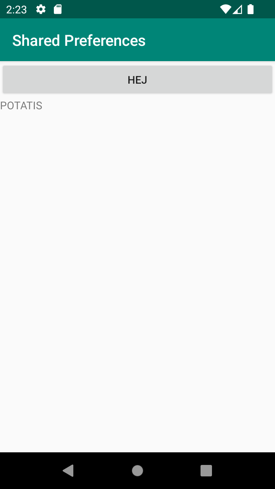
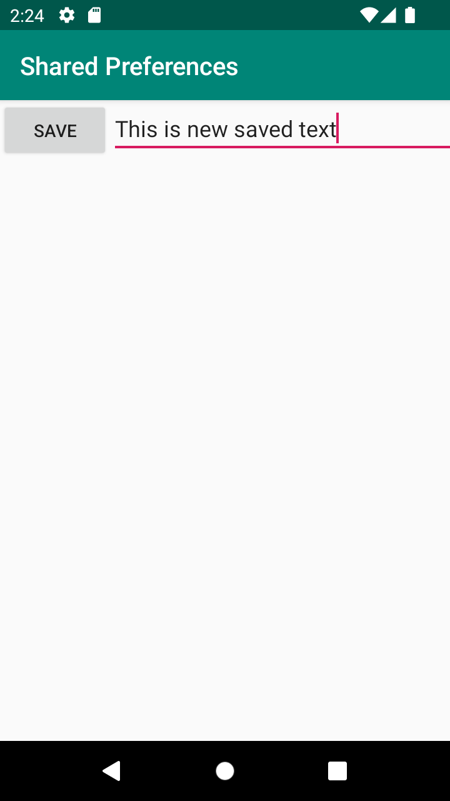
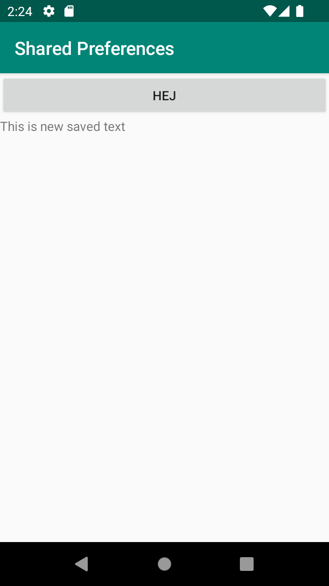

# Rapport
Lade till kod från canvas, som skapar en reference, och en editor. Därefter la jag även till information för att använda
referensen, för att kunna läsa data. Lade även till en TextView och en knapp i mainActivitys xml fil. Knappen kommer användas
för att ta sig vidare till SecondActivity, och TextView för att visa upp den "sparade" datan.
```
  private Button SeccondAcitivityButton;
  private SharedPreferences myPreferenceRef;
```
```
private SharedPreferences myPreferenceRef;
private SharedPreferences.Editor myPreferenceEditor;

 myPreferenceRef = getPreferences(MODE_PRIVATE);
        myPreferenceEditor = myPreferenceRef.edit();

        TextView prefTextRef=new TextView(this);
        prefTextRef=(TextView)findViewById(R.id.prefText);
        prefTextRef.setText(myPreferenceRef.getString("MyAppPreferenceString", "No preference found."));
```
Därefter skapade jag en ny empty views activity, SecondActivity, och lägger in EditText, samt en button i dess xml fil. Jag tog även bort överflödig kod för att passa projektets ändamål. 
Notera att dessa kodrader kommer från canvas. Eftersom canvas koden även inkluderade ett id som kräver en variabel i string-filen ("save" på button), lades denna till. 
Denna kommer användas senare i projektet.

Vi skapade en button i MainActivity, och dess xml fil, och lade sedan till en buttonListener till denna i main. Denna ska 
leda oss till den andra acitvityn i ett senare skede.
```
SeccondAcitivityButton.setOnClickListener(new View.OnClickListener() {
@Override
public void onClick(View view) {

                Intent intent = new Intent(MainActivity.this, SecondActivity.class);
                startActivity(intent);
            }
        });
```
Fixade gradle-versioner via build.gradle, där vi ändrade från '1.8.0' till 1.1.0. Detta eftersom den krånglade efter att vi lade till
en ny activity.
```
implementation 'androidx.activity:activity:1.1.0'
```
Jag flyttade även edit text till sidan om save knappen, i activity_second.xml, genom constraints.

Efter problem i kodsammanhang flyttar jag om metoder, så att prefTextRef sätts till den text som tagits från shared preferences genom tidigare
kod i MainActivity, se nedan.
```
myPreferenceRef = getSharedPreferences("MyAppPreferenceString",MODE_PRIVATE);
```
 -> Därmed sätts prefTextRef till den data som ligger i myPreferenceRef, som innebär att den sparade datan från SecondActivity appliceras i textViewn
i MainActivity.
```
prefTextRef=(TextView)findViewById(R.id.prefText);
prefTextRef.setText(myPreferenceRef.getString("MyAppPreferenceString", "No preference found."));
```
Notera att modifikation i activity_second innebar en savepref metod som istället ser ut som koden nedan. Denna applicerar den
text som vi skrivit in i EditText till shared preference editorn. Vilket gör att vi kan komma åt datan från main.
```
newPrefText = (EditText)findViewById(R.id.settingseditview);

        // Store the new preference
        myPreferenceEditor.putString("MyAppPreferenceString", newPrefText.getText().toString());
        myPreferenceEditor.apply();

        // Clear the EditText
        newPrefText.setText("");
```
This is the start screen, showing the initial text

Middle screen, showcasing the editText

End screen, presenting the editText data

